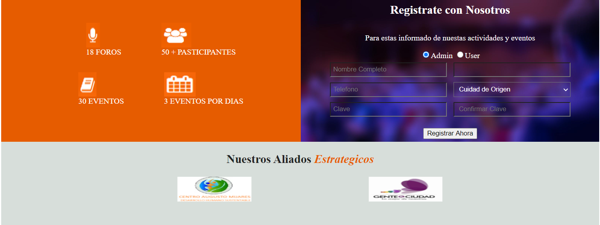
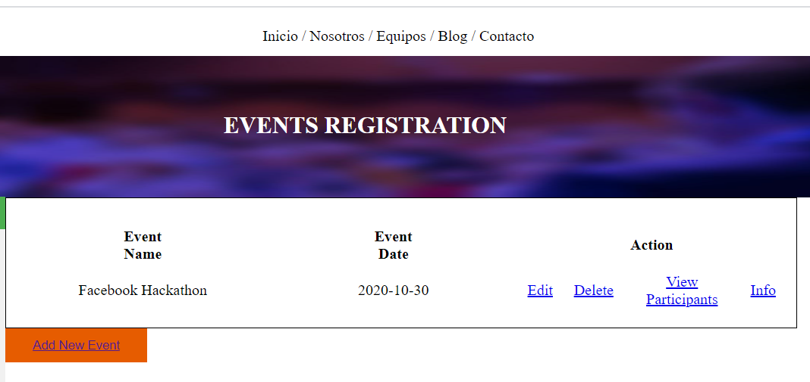
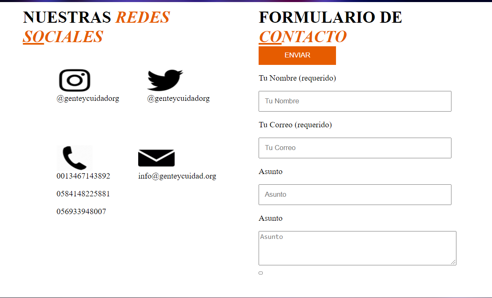
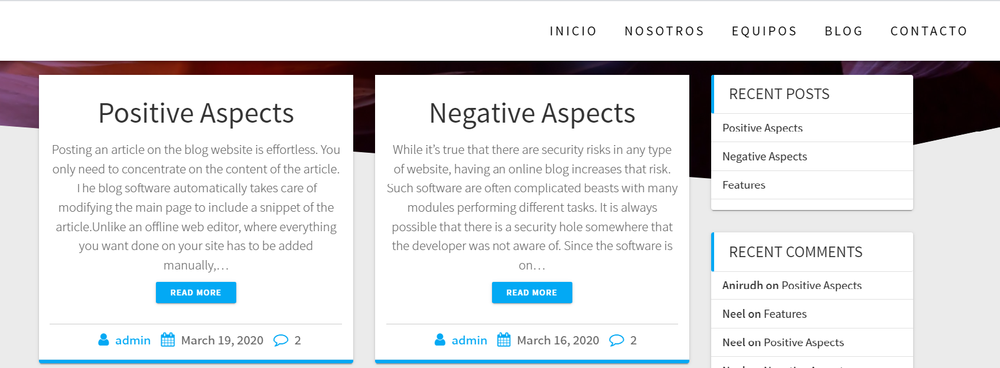
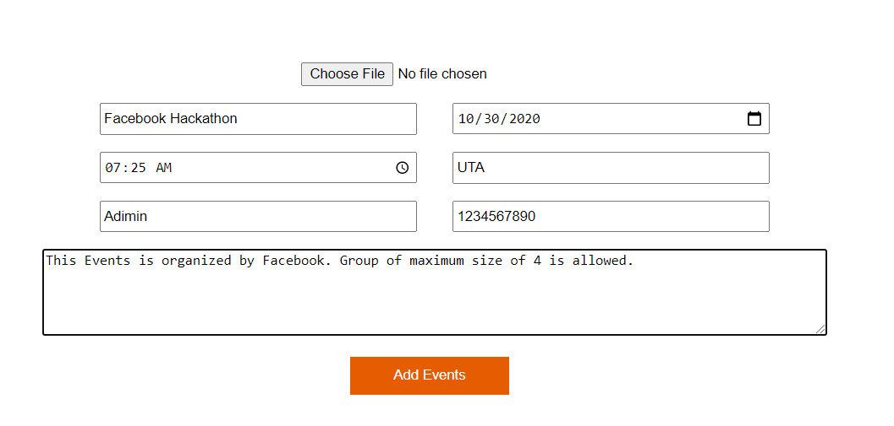

# Event Management Website
This website list down the events happening in your University and the user can easily register for the events.

# Tech/framework used
HTML,CSS,PHP,JavaScript,Laravel

# Few Screenshots
Register Page : 

Display Events Page : 

Contact Us Page : 

Blog : 

Add Events Page : 

# Features
- It allows the admin to post the events happening in your University.
- Admin can also view the list of all the students registered for the events.
- Admin can update , delete and add the events anytime.
- Admin also can post the blog about the events happened in the university with the informaton of key speakers atending the event.
- Students can register, de-register for the events.
- Students can also contact the admin about the information of events through the website.
 
# Link to Websie
http://krg6759.uta.cloud/gupta_ciudad/html/default1.php

# How to Use
(Website is been created in Spanish language)
- Create your account as Admin or as User.
- Once you registed as Admin you will be redirected to Add Events Page, Where you can Add, Update, Delete, View Events and its Information.
- If you registered as User, ou will be redirected to Register to Events, where you can register, de-reister for the events, and can also view the details about the events.

# License
UTA&copy;KiranGupta
